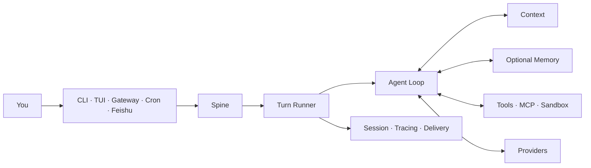
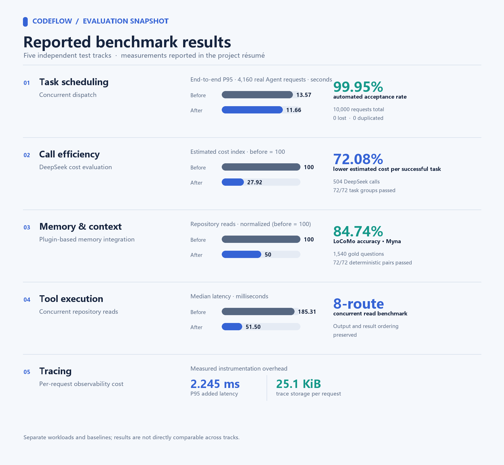

<div align="center">

# CodeFlow

### One Agent Runtime across every place you work.

Run the same tool-using agent in your terminal, native TUI, background Gateway,
scheduled jobs, and message channels. The entry point changes; the Turn,
Session, Context, tools, and evidence model stay the same.


[Quick start](#from-install-to-a-real-reply) ·
[First-use guide](docs/onboarding/README.zh-CN.md) ·
[Feishu](docs/onboarding/feishu.zh-CN.md) ·
[Agent install contract](docs/onboarding/agent-install.md) ·
[中文](README.zh-CN.md)

</div>

---

CodeFlow is an open-source Agent Runtime and Harness. CLI, native TUI, Gateway,
scheduled jobs, and messaging channels submit work through the same Runtime.
The native TUI includes a session-history sidebar for returning to earlier
conversations, while the Runtime handles scheduling, Context, tool execution,
Session persistence, tracing, and delivery. Optional Memory backends can plug
into the Runtime; this release does not bundle an external Memory implementation.



## Evaluation highlights

> Résumé-reported measurements from separate workloads and baselines; comparisons apply only within each stated test.



## From install to a real reply

CodeFlow requires Python 3.12. The native TUI uses Node.js 22; the installer can
provision a private Node runtime when the system version is missing or too old.

Clone the public repository and run the installer from the checkout:

```bash
git clone https://github.com/pei711/CodeFlow-harness.git
cd CodeFlow-harness
./install.sh
```

Windows PowerShell:

```powershell
git clone https://github.com/pei711/CodeFlow-harness.git
Set-Location CodeFlow-harness
.\install.ps1
```

The installer resolves CodeFlow from GitHub Releases and defaults to China-hosted
Python and Node.js mirrors. A private repository or restricted Release requires `CODEFLOW_GITHUB_TOKEN`. You
can also set `CODEFLOW_WHEEL_URL` to a trusted wheel URL.

| Installer control | Purpose |
| --- | --- |
| `CODEFLOW_GITHUB_TOKEN` | read a private GitHub Release |
| `CODEFLOW_WHEEL_URL` | install a trusted CodeFlow wheel directly |
| `CODEFLOW_PYPI_INDEX` | override the Python package index |
| `CODEFLOW_NODE_MIRROR` | override the Node.js download mirror |
| `CODEFLOW_NODE_CHECKSUM_BASE` | override the Node.js checksum source |
| `CODEFLOW_NPM_REGISTRY` | override the npm registry |
| `CODEFLOW_UV_INSTALL_URL` | override the uv installer URL |

Configure CodeFlow inside the repository where the agent will work:

```bash
cd /path/to/your-project
codeflow onboard --skip-memory
```

The four-step wizard follows the first result you can verify:

```text
LLM credentials -> Memory explicitly off -> first real Turn
                -> run location -> optional message channel
```

This release does not contain an external Memory implementation,
so `--skip-memory` is the supported path. CodeFlow records
`memory.backend = null`; it does not pretend that a missing backend is healthy.

After onboarding:

```bash
codeflow
codeflow run -m "Map the main request path in this repository"
codeflow doctor --probe
```

`codeflow doctor --probe` sends a real model request. A static configuration check
or a skipped probe does not prove that the Provider returned a reply.

See the [first-use guide](docs/onboarding/README.zh-CN.md) for private Release
authentication, non-interactive setup, exact acceptance checks, and recovery
paths.

## What CodeFlow owns

| What you need | What CodeFlow does |
| --- | --- |
| One agent across several surfaces | CLI, TUI, Gateway, Cron, and Channels submit the same Turn contract |
| Context that does not become a prompt dump | Context is retrieved, budgeted, and assembled before each model call |
| Tools with explicit boundaries | Filesystem, Shell, Web, MCP, messaging, and Subagents share confirmation and Sandbox controls |
| Recoverable conversations | Sessions persist independently from the current terminal process |
| Debuggable outcomes | Tracing, Provider usage, delivery state, and evaluation evidence remain separate records |
| Controlled improvement | Evolver produces candidates and evidence; activation and rollback remain explicit operator actions |

## Connect Feishu

CodeFlow uses Feishu's WebSocket long connection, so you do not need a public IP or
webhook domain.

```bash
codeflow channels enable feishu \
  --app-id "cli_xxxxxxxxxxxxxxxx" \
  --app-secret "$FEISHU_APP_SECRET"

cd /path/to/your-project
codeflow gateway --workspace "$PWD" --verbose
```

The Feishu app still needs bot capability, message permissions,
`im.message.receive_v1`, and a published application version. Follow the
[Feishu guide](docs/onboarding/feishu.zh-CN.md) before testing an inbound
message. Saving channel configuration does not prove that live delivery works.

## Commands worth remembering

| Goal | Command |
| --- | --- |
| Configure CodeFlow and run the first Turn | `codeflow onboard --skip-memory` |
| Open the native TUI | `codeflow` |
| Execute one Turn | `codeflow run -m "..."` |
| Check Runtime and Provider health | `codeflow doctor --probe` |
| Inspect installed Plugins | `codeflow plugins` |
| Manage message channels | `codeflow channels ...` |
| Serve enabled channels | `codeflow gateway --workspace /path/to/project` |
| Manage scheduled work | `codeflow cron ...` |
| Inspect Sessions and Tracing | `codeflow sessions ...` / `codeflow tracing` |
| Run operator-controlled evolution | `codeflow evolve check\|run\|status\|finalize` |

## State and security

| Scope | Default location |
| --- | --- |
| Global configuration and Runtime data | `~/.codeflow` |
| Foreground project | current directory |
| Foreground project state | `~/.codeflow/projects/<project-id>` |
| Gateway Workspace | explicit `--workspace`, otherwise `~/.codeflow/workspace` |

Normal startup keeps CodeFlow state outside the repository. Executable Plugins are
loaded only from CodeFlow's bundled set, operator-managed `~/.codeflow/plugins/`, and
installed `codeflow.plugins` entry points. A checkout's `.codeflow/plugins/` directory
is not an automatic startup source.

Read the [Memory boundary](docs/onboarding/memory.zh-CN.md) and
[troubleshooting guide](docs/onboarding/troubleshooting.md) before changing a
backend or handing the installation to another operator.

## Release repository boundary

This repository contains publishable source, deterministic tests, reviewed
benchmark code and fixtures, installers, onboarding material, and legal
notices. It excludes development plans, raw run artifacts, credentials, private
environment instructions, and unpublished external Memory artifacts.

Public benchmark results apply only to the frozen workload and verifier named
in their documents. They are not production SLAs. Start with the
[evaluation index](docs/evaluation/README.md) and [`benchmarks/`](benchmarks/).

## Contributing

Start with an issue labeled `good-first-issue`. Every claimable issue names its
target branch, relevant files, scope, and acceptance command. Comment on the
issue before starting, then submit one pull request for that issue.

See the [contribution guide](CONTRIBUTING.md) for branch selection, local
verification, and safety requirements. Remove tokens, private keys, internal
addresses, and personal data from public issue reports.

## Build and verify

```bash
uv sync --frozen --extra dev --dev
npm ci
npm ci --prefix ui-tui
make check
make codeflowbench-smoke
CODEFLOW_RELEASE_OUTPUT=/absolute/empty/output make release-dist
```

CodeFlow is pre-1.0. Interfaces can change. `make check` verifies the retained
release tree; it does not replace a real Provider or channel smoke test.

## License

CodeFlow is licensed under Apache License 2.0. See [LICENSE](LICENSE),
[NOTICES.md](NOTICES.md), and [LICENSES/](LICENSES/) for attribution.
