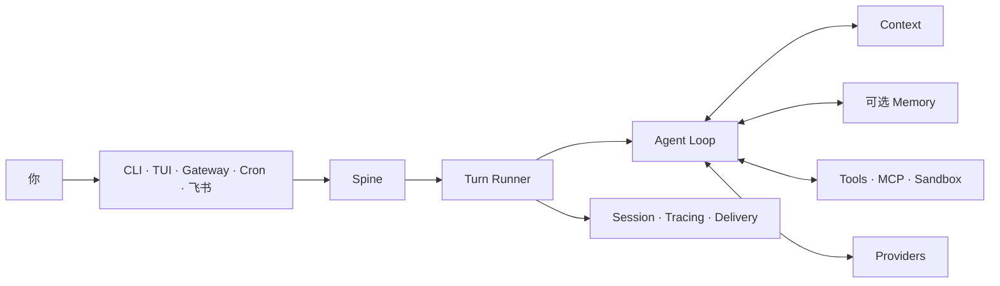
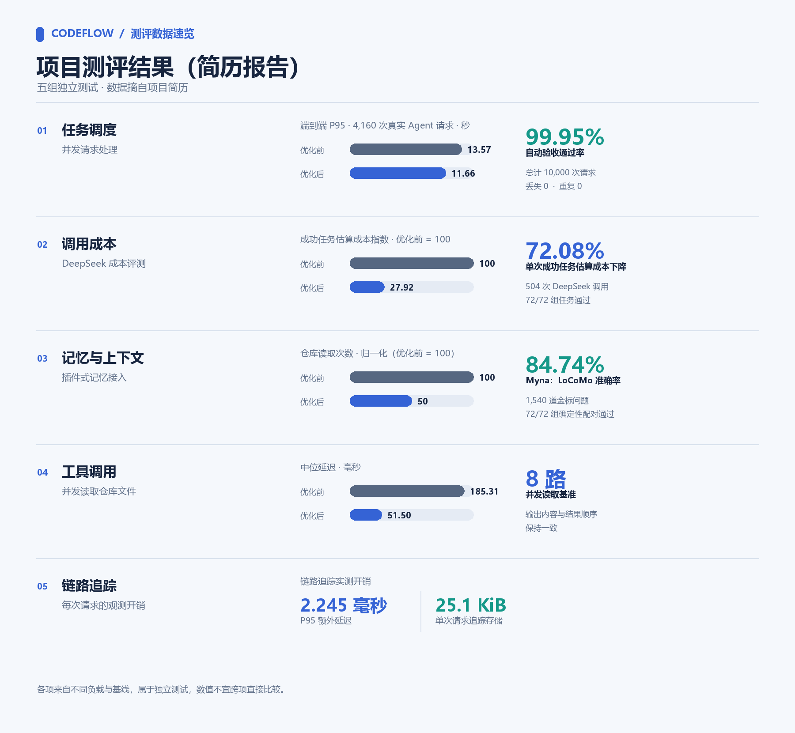

<div align="center">

# CodeFlow-harness

### 面向多任务并发与多轮对话的 Agent Harness。

支持并发任务调度和多轮会话执行，并提供上下文治理、Checkpoint / Resume、SRT 工具沙箱与回归评测。
CLI、原生 TUI、Gateway、定时任务和消息渠道共用同一套 Runtime、会话与执行边界。


[快速开始](#从安装到第一条真实回复) ·
[首次使用指南](docs/onboarding/README.zh-CN.md) ·
[SRT Shell 沙箱](docs/onboarding/srt-sandbox.zh-CN.md) ·
[飞书接入](docs/onboarding/feishu.zh-CN.md) ·
[Agent 安装契约](docs/onboarding/agent-install.md) ·
[English](README.md)

</div>

---

## 项目介绍

CodeFlow-harness 是面向多任务并发与多轮对话的开源 Agent Harness，目标是让任务执行可复盘、可评测，
并具有明确的工具执行边界。它通过会话队列和并发额度调度请求，支持同会话工具有序执行与跨会话并行；
Checkpoint / Resume 用于中断恢复，Context 管理负责预算与压缩，SRT 为 Shell 命令提供操作系统级沙箱。

CLI、原生 TUI、后台 Gateway、定时任务和消息渠道共用同一套 Runtime。Runtime 负责调度与取消、
上下文组装、工具调用、Session 持久化、链路追踪和结果交付；原生 TUI 支持查看并继续历史会话。
评测体系覆盖任务调度、模型调用成本、上下文与记忆、工具执行和恢复能力。
Shell 可选择 Anthropic SRT 操作系统沙箱或 BoxLite MicroVM；SRT 初始化或运行不可用时会拒绝执行，
不会静默退回宿主机 Shell。

CodeFlow 也提供 CodeFlowBench，用来评估 Agent Runtime、Context、工具与记忆相关能力。
外部 Memory Backend 可以按需接入；未配置时，系统会明确保持关闭状态。项目运行环境为
Python 3.12，原生 TUI 使用 Node.js 22。

上下文管理采用 CodeFlow 的分层方案：每次模型调用前按前缀、Memory、Skills、相关记忆和历史分配预算，
当前用户请求保持完整；随着历史压力升高，先压缩旧工具结果、再优先裁剪旧轮次，达到高压阈值时将较早历史
总结并记录边界，同时继续携带最近对话。已完成轮次会生成本地摘要，新问题通过语义检索与 BM25 两路召回，
再用 RRF 融合排名，最多注入三条。语义模型可通过 `semantic-memory` extra 安装；未安装或模型不可用时，
使用 TF-IDF 字符向量与 BM25 降级。摘要保存在项目 Runtime 状态目录的 `context_memory/` 中。



## 测评结果概览

> 摘录项目评测结果。数据来自不同负载与基线，各项只在各自测试范围内比较，不跨项对比。



## 从安装到第一条真实回复

CodeFlow 需要 Python 3.12。原生 TUI 使用 Node.js 22；系统缺少合适版本时，安装器
可以配置私有 Node Runtime。

克隆公开仓库后，在项目根目录运行安装器：

```bash
git clone https://github.com/pei711/CodeFlow-harness.git
cd CodeFlow-harness
./install.sh
```

Windows PowerShell：

```powershell
git clone https://github.com/pei711/CodeFlow-harness.git
Set-Location CodeFlow-harness
.\install.ps1
```

安装器可以从 GitHub Release 解析 CodeFlow wheel，并默认使用国内 Python 与 Node.js 镜像。
访问私有仓库或受限 Release 时设置 `CODEFLOW_GITHUB_TOKEN`；需要固定制品时，可以设置
`CODEFLOW_WHEEL_URL` 指向经过信任的 wheel。

| 安装控制项 | 用途 |
| --- | --- |
| `CODEFLOW_GITHUB_TOKEN` | 读取私有仓库或受限 Release |
| `CODEFLOW_WHEEL_URL` | 直接安装经过信任的 CodeFlow wheel |
| `CODEFLOW_PYPI_INDEX` | 覆盖 Python 包索引 |
| `CODEFLOW_NODE_MIRROR` | 覆盖 Node.js 下载镜像 |
| `CODEFLOW_NODE_CHECKSUM_BASE` | 覆盖 Node.js 校验清单来源 |
| `CODEFLOW_NPM_REGISTRY` | 覆盖 npm registry |
| `CODEFLOW_UV_INSTALL_URL` | 覆盖 uv 安装脚本地址 |

进入希望 CodeFlow 工作的仓库，再完成首次配置：

```bash
cd /path/to/your-project
codeflow onboard --skip-memory
```

向导按照第一个可验证结果组织为四步：

```text
LLM 凭证 -> 明确关闭 Memory -> 第一条真实 Turn
         -> 运行位置 -> 可选消息渠道
```

当前版本不包含外部 Memory 实现，因此 `--skip-memory` 是受支持的路径。
CodeFlow 会写入 `memory.backend = null`，不会把缺失的 Backend 伪装成健康状态。

向导完成后：

```bash
codeflow
codeflow run -m "说明这个仓库的主请求路径"
codeflow doctor --probe
```

`codeflow doctor --probe` 会发送一次真实模型请求。静态配置检查通过，或者跳过 probe，
都不能证明 Provider 已经返回回复。

Shell 命令可选用 BoxLite MicroVM 或 Anthropic SRT 操作系统沙箱；首次启用、策略范围和运行限制见
[SRT Shell 沙箱指南](docs/onboarding/srt-sandbox.zh-CN.md)。

[首次使用指南](docs/onboarding/README.zh-CN.md)包含 Private Release 鉴权、
非交互配置、精确验收命令和常见恢复路径。

## CodeFlow 负责什么

| 你需要什么 | CodeFlow 负责什么 |
| --- | --- |
| 一个 Agent 跨多个入口 | CLI、TUI、Gateway、Cron 和 Channels 提交同一个 Turn 契约 |
| Context 不变成 Prompt 堆积 | 每次模型调用前检索、预算并组装 Context |
| 有明确边界的工具 | Filesystem、Shell、Web、MCP、消息和 Subagent 共用确认与 Sandbox 控制 |
| 可以恢复的对话 | Session 独立于当前终端进程持久化 |
| 可以定位的结果 | Tracing、Provider 用量、投递状态和评测证据分别记录 |
| 人工控制的改进 | Evolver 生成候选和证据，激活与回滚由操作人员明确执行 |

## 接入飞书

CodeFlow 使用飞书 WebSocket 长连接，不需要公网 IP 或 Webhook 域名。

```bash
codeflow channels enable feishu \
  --app-id "cli_xxxxxxxxxxxxxxxx" \
  --app-secret "$FEISHU_APP_SECRET"

cd /path/to/your-project
codeflow gateway --workspace "$PWD" --verbose
```

飞书应用仍然需要机器人能力、消息权限、`im.message.receive_v1` 和已发布的应用版本。
发送入站消息前，请先完成[飞书接入指南](docs/onboarding/feishu.zh-CN.md)。配置写入
成功不能证明真实收发链路已经工作。

## 值得记住的命令

| 目标 | 命令 |
| --- | --- |
| 配置 CodeFlow 并执行第一条 Turn | `codeflow onboard --skip-memory` |
| 打开原生 TUI | `codeflow` |
| 执行一次 Turn | `codeflow run -m "..."` |
| 检查 Runtime 与 Provider | `codeflow doctor --probe` |
| 查看已安装 Plugin | `codeflow plugins` |
| 管理消息渠道 | `codeflow channels ...` |
| 服务已启用的渠道 | `codeflow gateway --workspace /path/to/project` |
| 管理定时任务 | `codeflow cron ...` |
| 查看 Session 与 Tracing | `codeflow sessions ...` / `codeflow tracing` |
| 执行人工受控的演进 | `codeflow evolve check\|run\|status\|finalize` |

## 状态与安全

| 范围 | 默认位置 |
| --- | --- |
| 全局配置与 Runtime 数据 | `~/.codeflow` |
| 前台项目 | 当前目录 |
| 前台项目状态 | `~/.codeflow/projects/<project-id>` |
| Gateway Workspace | 显式传入 `--workspace`，否则使用 `~/.codeflow/workspace` |

正常启动会把 CodeFlow 状态放在仓库之外。可执行 Plugin 只从 CodeFlow 内置目录、操作人员
管理的 `~/.codeflow/plugins/` 和已安装的 `codeflow.plugins` entry point 中发现。
仓库里的 `.codeflow/plugins/` 不会成为自动启动来源。

修改 Backend 或把安装交给其他操作人员前，请先阅读
[Memory 边界](docs/onboarding/memory.zh-CN.md)和
[故障排查](docs/onboarding/troubleshooting.md)。

## 发布仓库边界

这个仓库保留可发布源码、确定性测试、经过审核的 Benchmark 代码与 Fixture、
安装器、Onboarding 文档和法律文件。开发计划、原始运行数据、真实凭证、私有环境说明
和未发布的外部 Memory 制品不会进入发布仓库。

公开 Benchmark 结果只适用于文档中写明的冻结 Workload 与 Verifier，不能外推为
生产 SLA。评测入口见[评测索引](docs/evaluation/README.md)和
[`benchmarks/`](benchmarks/)。

## 参与贡献

第一次参与 CodeFlow，可以从带有 `good-first-issue` 标签的任务开始。每个可认领任务都会
写明目标分支、相关文件、范围和验收命令；请先在 Issue 下留言认领，再提交一个只处理
该问题的 Pull Request。

完整流程、分支说明和本地验证命令见[贡献指南](CONTRIBUTING.md)。Bug 报告请使用
GitHub Issue 模板，并在公开内容中移除 Token、私钥、内部地址和个人数据。

## 开发与验证

```bash
uv sync --frozen --extra dev --dev
npm ci
npm ci --prefix ui-tui
make check
make codeflowbench-smoke
CODEFLOW_RELEASE_OUTPUT=/absolute/empty/output make release-dist
```

CodeFlow 仍处于 pre-1.0，接口可能变化。`make check` 验证保留的发布树，不能替代真实
Provider 或消息渠道的 Smoke Test。

## 许可证

CodeFlow 使用 Apache License 2.0。第三方归属与许可证见 [LICENSE](LICENSE)、
[NOTICES.md](NOTICES.md) 和 [LICENSES/](LICENSES/)。
